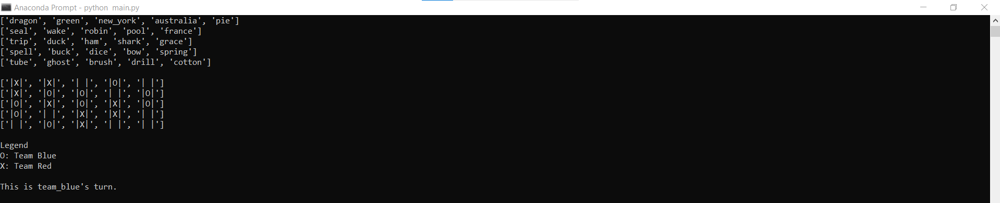
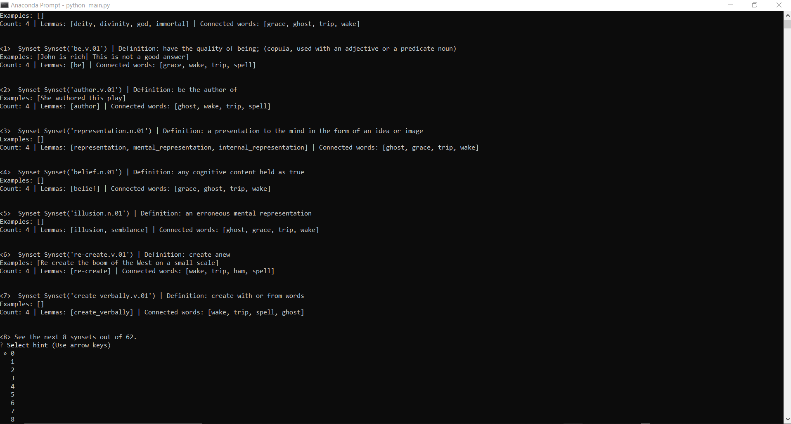

# Codenames Cheat Engine

This is a python library to generate clue in the Boardgame Codenames, in form of an CLI. It is a part of fun experiment in this <a href="https://hovinh.github.io/blog/2021-01-16-codenames-cheat-engine/">blog post</a>. 

## Environment Setup

You create a virtual environment for this project as follows:
```bash
conda create -n codenames python=3.6
conda activate codenames
conda install numpy scipy
conda install -c anaconda scikit-learn
conda install -c conda-forge matplotlib
conda install -c anaconda nltk
conda install -c anaconda ipykernel
conda install -c anaconda opentsne
pip install questionary
python -m ipykernel install --user --name=codenames
```

## Getting-started
### Directory structure
- `main.py`: user only needs to care about this file. Define your game in `select_game()` function and picks corresponding `game_idx` in `__main__()` then you are good to go.
- `boardgame.py`, `spymaster.py`, `hint.py`: these implements the three interactive classes `CodenamesBoardGame`, `SpyMaster`, and `Hint` respectively.
- `glove_tsne.ipynb`, `tsne.txt`: experiment to inspect hypothesis a centroid vector captures analogy to its nearby neighbour words, and its visualization with Open t-SNE tool.

### Running
1. Select `game_idx` in `main.py`.
```python
game_idx = 2
```
2. Open Anaconda Prompt, redirect to the directory and type in:
```bash
conda activate codenames
python main.py
```

### Expected Behaviour

<br/>
<p align="center">
  
  <br><br>
  <b>Starting screen</b><br>
</p>

<p align="center">
  
  <br><br>
  <b>Selection screen</b><br>
</p>


## Contact
Feel free to contact me via email: hxvinh.hcmus@gmail.com